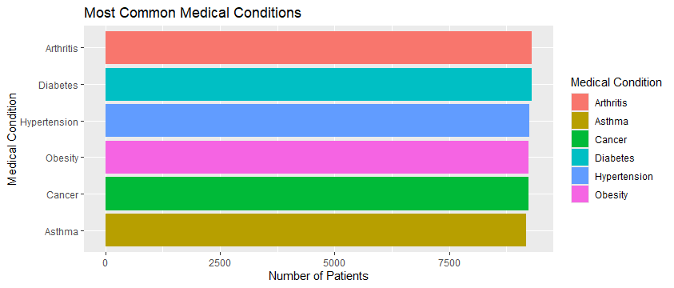
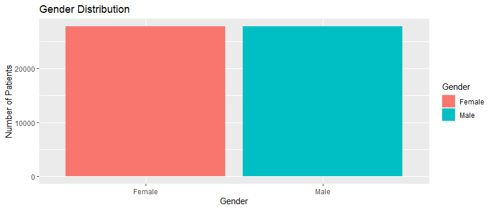
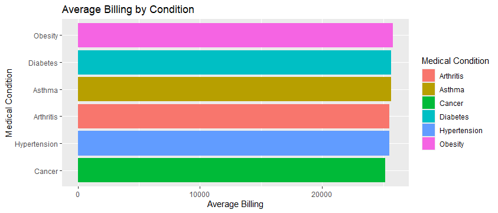
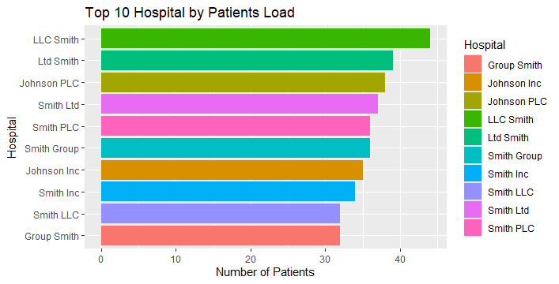
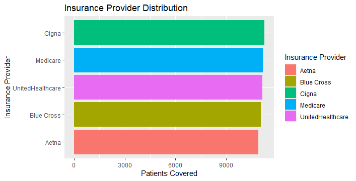
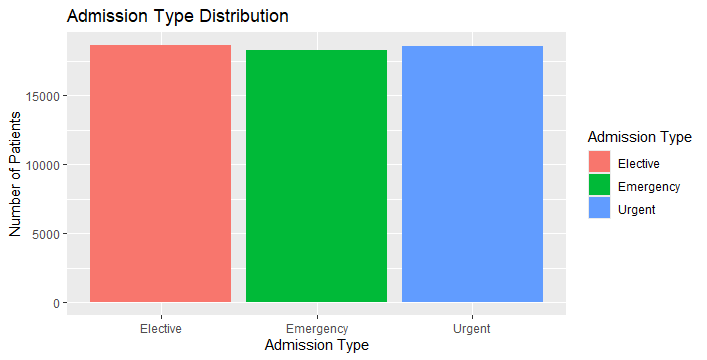
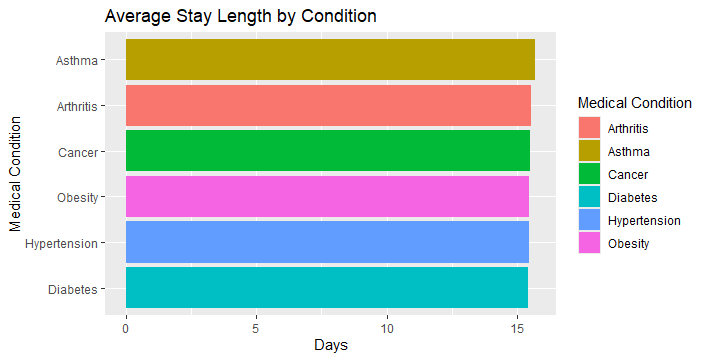
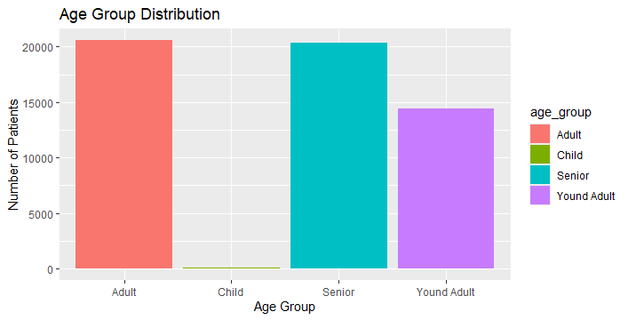
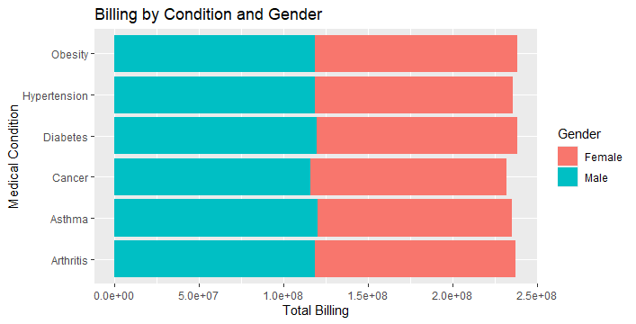

# Project Title
Hospital Patient Analysis Using SQL and R

# Project Overview
This project presents a hospital patient analysis using Structured Query Language (SQL) and R programming to explore patient demographics, admission patterns, medical conditions, hospital utilization, billing behaviour, and insurance coverage within a healthcare system.
The analysis was conducted using the Healthcare Dataset obtained from Kaggle, which contains 55,500 patient-level healthcare records including demographic information, admission details, medical conditions, treatment costs, insurance providers, medications, and diagnostic test results.
The objective of the project was to transform raw healthcare data into meaningful business and operational insights that can support hospital administrators, healthcare analysts, and policy decision-makers in understanding patient trends, cost patterns, and healthcare service demand.
Using SQL, the dataset was imported into a relational database environment where data cleaning, feature engineering, and business analysis were performed. Additional analytical variables such as patient identifiers, length of hospital stay, and age group classifications were created to improve analysis depth.
Using R programming, particularly tidyverse, dplyr, and ggplot2, the findings from SQL analysis were transformed into visual insights through charts and exploratory visualizations that communicate patient distribution, billing trends, hospital workload, and healthcare usage patterns.
The insights generated from this analysis help healthcare organizations understand disease prevalence, identify major cost drivers, evaluate hospital demand, and support strategic planning for improved healthcare delivery and resource allocation.

# Tools Used
•	SQL (MySQL)
•	MySQL Workbench: For database creation, data cleaning, and SQL analysis
•	R
•	tidyverse: For end-to-end analytical workflow
•	dplyr: For data transformation and summarization
•	ggplot2: For visualization and reporting

# Data Description
Dataset source: Healthcare Dataset (CSV file obtained from Kaggle)
The dataset contains hospital patient records representing healthcare admissions, diagnoses, treatments, insurance coverage, and billing information. Each row corresponds to one patient hospital admission record.

# Dataset Variables
•	Name: Patient name
•	Age: Patient age
•	Gender: Patient gender
•	Blood Type: Blood group classification
•	Medical Condition: Diagnosed health condition
•	Date of Admission: Date patient was admitted
•	Doctor: Assigned physician
•	Hospital: Hospital name
•	Insurance Provider: Insurance coverage provider
•	Billing Amount: Total treatment billing cost
•	Room Number:  Assigned room number
•	Admission Type: Emergency, Urgent, or Elective admission
•	Discharge Date: Date patient was discharged
•	Medication: Prescribed medication
•	Test Results: Diagnostic result classification

# Engineered Variables: Created During Analysis
To improve analytical depth, additional variables were created during SQL and R analysis:
•	patient_id: Unique identifier created for each patient record
•	stay_length: Number of days spent in hospital, calculated as:
Stay Length = Discharge Date − Admission Date
•	age_group – Patient age classification:
	Child → Below 18 years
	Young Adult → 18–35 years
	Adult → 36–60 years
	Senior → Above 60 years
These engineered variables improved patient segmentation analysis and healthcare utilization assessment.

# Data Cleaning
Before analysis, the dataset was cleaned and transformed to improve quality and analytical reliability
•	Imported raw CSV data into SQL database environment
•	Created a unique patient_id primary key for each record
•	Standardized inconsistent text formatting in patient names
•	Calculated patient hospital stay length using admission and discharge dates
•	Created age_group classifications for patient segmentation
•	Verified date columns for correct date formatting
•	Prepared cleaned analytical dataset for SQL querying and R visualization
•	Recreated engineered features in R for visualization consistency
These cleaning steps transformed raw healthcare records into analysis-ready structured data.

# Business Questions
The analysis was guided by the following key business questions
	Which medical condition appears most frequently among patients?
	What is the gender distribution of hospital patients?
	Which medical condition has the highest average billing amount?
	Which hospitals handle the highest patient load?
	Which insurance provider covers the largest patient population?
	Which admission type is most common?
	What is the average hospital stay length by medical condition?
	Which age group visits hospitals most frequently?
	Which patients incur the highest healthcare costs?
	Which medical condition and gender combination generates the highest total billing?

# SQL Analysis Performed
The SQL analysis used core SQL concepts including
	SELECT
	FROM
	WHERE
	ORDER BY
	GROUP BY
	Aggregate Functions (COUNT, SUM, AVG)
	CASE Statements
Analytical SQL queries were used to summarize healthcare trends, patient distribution, billing patterns, and operational hospital insights.

# Key Insights
•	One medical condition emerged as the most frequently diagnosed among patients, indicating a higher concentration of cases in that category and suggesting greater healthcare demand for its treatment and management.
•	The patient population showed a measurable difference between male and female admissions, highlighting gender-based variation in healthcare utilization and possible differences in disease exposure or treatment-seeking behaviour.
•	Certain medical conditions generated significantly higher average billing amounts than others, indicating that some diagnoses require more expensive treatments, longer care periods, or specialized medical procedures.
•	Patient admissions were not evenly distributed across hospitals, with some healthcare facilities handling substantially larger patient volumes, suggesting differences in capacity, reputation, specialization, or accessibility.
•	Insurance coverage was concentrated among major providers, with certain insurance companies covering a significantly larger proportion of patients, indicating strong market dominance within the healthcare financing system.
•	Emergency and urgent admissions represented a major share of total hospital visits, emphasizing the importance of emergency response readiness, resource allocation, and efficient patient intake management.
•	Average hospital stay varied across medical conditions, showing that some illnesses require extended treatment durations, increased monitoring, and greater hospital resource utilization.
•	Adult and senior patients represented the largest share of hospital visits, indicating that middle-aged and older populations are the most active users of healthcare services within the dataset.
•	A segment of patients incurred exceptionally high billing amounts, suggesting the presence of costly treatments, complex medical conditions, or prolonged hospital care that significantly contribute to overall healthcare expenditure.
•	The combination of medical condition and gender revealed notable differences in total billing contribution, indicating that healthcare costs are influenced not only by diagnosis type but also by demographic patient characteristics.

# Visualization
Charts were created using ggplot2 to communicate findings visually: Bar Chart: Most Common Medical Conditions. Bar Chart: Gender Distribution of Patients. Horizontal Bar Chart: Average Billing by Medical Condition. Horizontal Bar Chart: Top 10 Hospitals by Patient Load. Bar Chart: Insurance Provider Distribution. Bar Chart: Admission Type Distribution. Horizontal Bar Chart: Average Stay Length by Condition. Bar Chart: Age Group Distribution. Stacked Bar Chart: Billing by Medical Condition and Gender

This chart shows that all six medical conditions affect a similar number of patients, with each condition having around 9,000 patients. Arthritis is the most common and Asthma is the least common. However, the gap between them is very small.

This chart shows that the number of male and female patients is almost equal, with both groups having around 25,000 patients. Just a little difference in gender distribution.

This chart shows that the average hospital bill is about the same for all six medical conditions, which is around 25,000. Obesity has the highest average bill and Cancer has the lowest. However, the difference between them is very small.

This chart shows that LLC Smith has the highest patient load with about 44 patients, while Group Smith has the lowest with around 32 patients. However, the patient numbers across the top 10 hospitals are fairly close, ranging from 32 to 44 patients.

This chart shows that, providers cover nearly the same number of patients, with each covering around 10,500 to 11,000 people. Cigna covers the most patients and Aetna covers the fewest. However, the difference is very small.

The chart shows that patients are admitted to the hospital in almost equal numbers for Elective, Emergency, and Urgent reasons. All three admission types have around 18,000 patients. However, with little difference in number, higher than the others.

This chart shows that patients stay in the hospital for nearly the same number of days for all six conditions is about 15-16 days. Asthma has the longest average stay and Diabetes has the shortest. However, the difference is less than one day.

This chart shows that most patients are Adults and Seniors, with about 20,000 in each group. Very few patients are Children, and Young Adults are in the middle with around 15,000 patients.

This chart shows that total hospital billing is roughly split evenly between male and female patients for all six conditions. Females account for slightly more billing overall, especially for Arthritis and Diabetes, while males account for slightly more for Cancer and Obesity.

These visualizations helped simplify healthcare patterns into easily interpretable insights.

# Conclusion 
The analysis showed that hospital admissions, treatment costs, and patient demographics vary significantly across medical conditions, hospitals, insurance providers, and age groups.
 
# Recommendation
Based on these findings, healthcare organizations should consider the following strategies:
•	Allocate resources toward high-frequency medical conditions to improve treatment efficiency
•	Increase operational readiness for Emergency and Urgent admission categories
•	Improve bed management planning using stay_length analysis
•	Develop preventive healthcare initiatives targeting high-risk age groups
•	Partner strategically with major insurance providers to improve patient financial access
•	Investigate high-cost treatment categories for billing optimization and cost management
•	Expand staffing and operational capacity in hospitals with consistently high patient load
These strategies can improve healthcare delivery, operational planning, patient care quality, and financial sustainability.

# Author
Franklin Chisom
Data Analyst | SQL & R Programming Enthusiast
